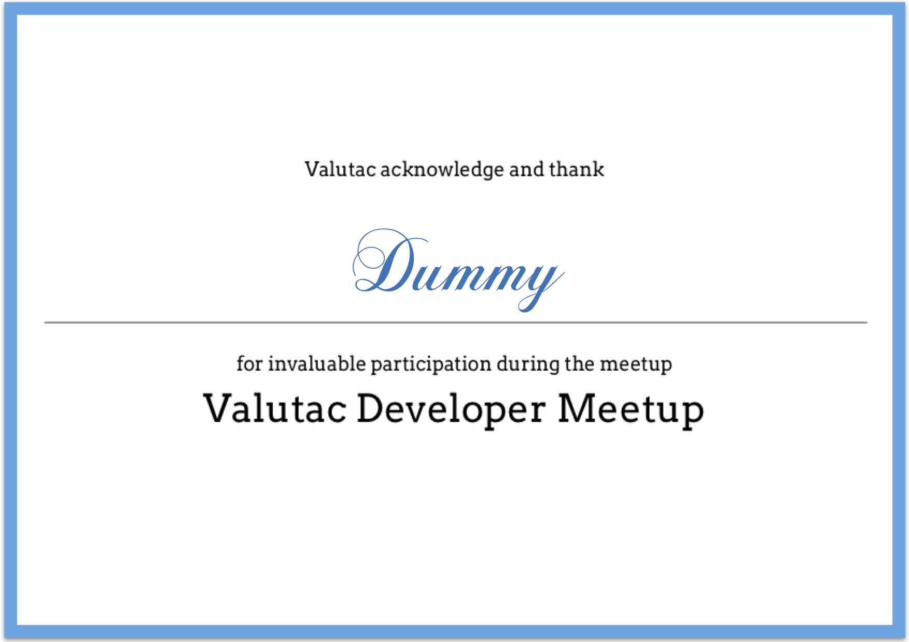

# Accent

[](https://goreportcard.com/report/github.com/valutac/accent)

Send certificate to your meetup or event participant

## Configuration

All configuration is under `config.toml` file.

### Using Testing Mode

To use testing mode change `enable` variable to `true`, for production change it to `false`
```
[app.dummy]
enable=true
target="support@valutac.com"
```
### SMTP Server

Change credentials in `config.toml` file to your SMTP server

```
[app.email]
host="smtp.example.com"
port=587
username="email@example.com"
password="password"
```

## Build & Run

```
$ go build -o accent
$ ./accent -dummy=false -file=source.csv -send=true
```

### Parameters


- `dummy` has two value, true/false. Whenever the value is false, it will send to support@valutac.com. You can change the target on the code and rebuild the binary. Use this dummy option to check the email which will be sent to participant.
- `file` is the data input, please check `dummy.csv` file to see the format file.
- `send` if the value is true, it will send the certificate.


### Template

There is two template in this application:

- Email template `email.html` - create your own html template.
- Certificate template `template.png` - design your own template.

### Example Certificate



## LICENSE

<a href="LICENSE">
</img>
</a>
